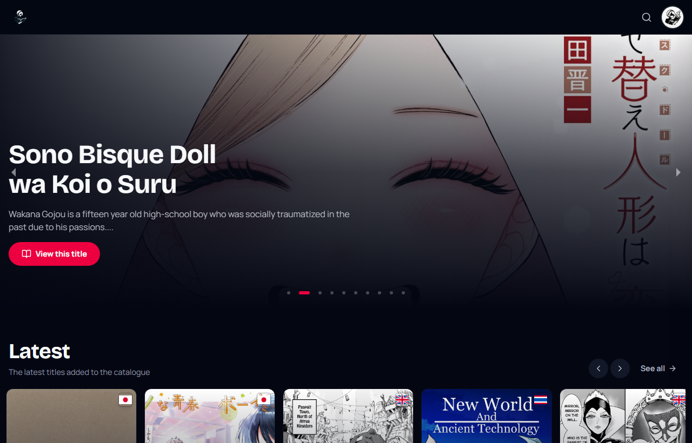
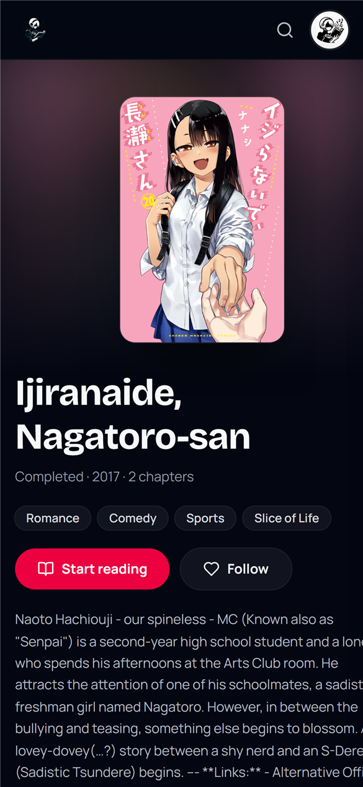
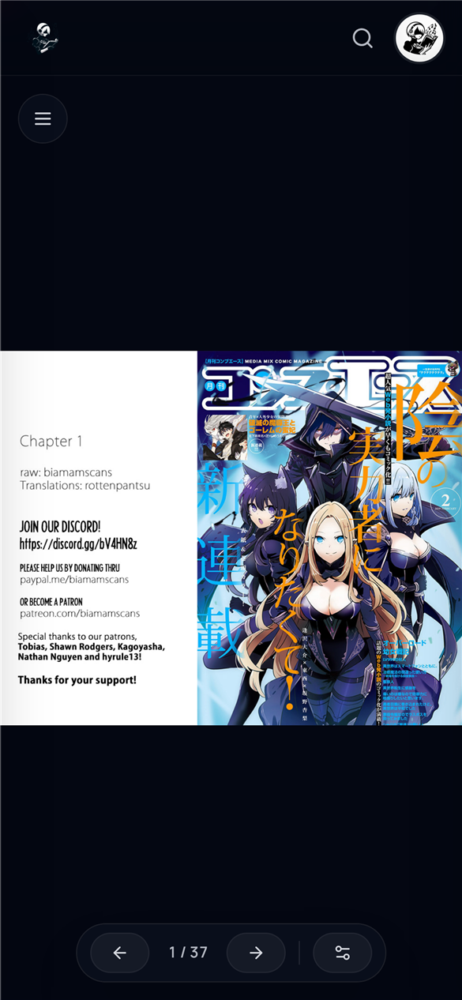
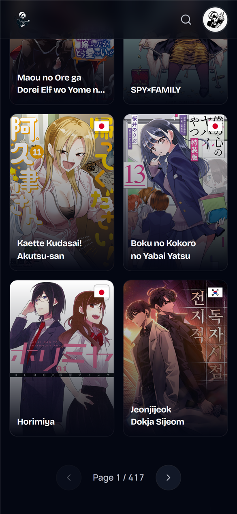
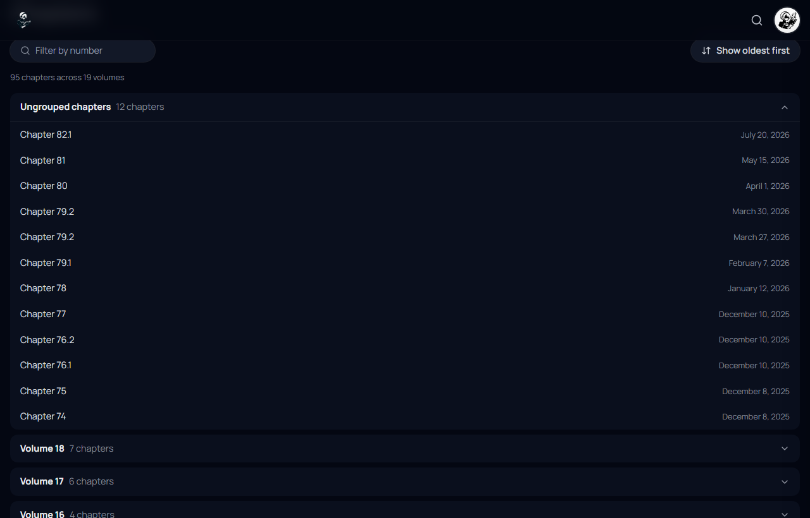

<div align="center">

# 📚 ScanGo — MangaGo

**A full-stack manga reader inspired by MangaDex.**
Real-time catalogue, an immersive chapter reader, accounts, reading history and social features.




</div>

---

## ✨ Highlights

- **Live catalogue** aggregated from the MangaDex API — trending, latest and full browse.
- **Immersive reader** — paged & continuous modes, auto-detected per title, adjustable fit/width, right-to-left support, double-page spreads, keyboard, **swipe** and **tap-to-toggle** controls.
- **Reading history that follows you** — read chapters are ticked off, and each title shows a smart **Continue** button that resumes at your first unread chapter.
- **Accounts & social** — JWT auth (bcrypt), favorites, per-chapter comments, customizable profiles.
- **Safe by default** — server-side content filtering enforced on every path, so a direct link can't bypass it.
- **Fast** — independent MangaDex calls run in parallel with a short-lived cache; the homepage responds in milliseconds once warm.
- **Responsive** — built mobile-first: scroll-locked drawers, compact pagination, gesture-driven reader.

## 📱 Screenshots

<table>
  <tr>
    <td width="33%"></td>
    <td width="33%"></td>
    <td width="33%"></td>
  </tr>
  <tr>
    <td align="center"><em>Title page</em></td>
    <td align="center"><em>Immersive reader</em></td>
    <td align="center"><em>Mobile catalogue</em></td>
  </tr>
</table>



## 🛠️ Tech Stack

| Layer | Technology |
|---|---|
| **Frontend** | React 18, React Router, Vite, Tailwind CSS v4 |
| **Backend** | Golang (REST API, JWT auth) |
| **Database** | MongoDB (users, comments, preferences, history) |
| **Services** | Docker & Docker Compose, Cloudinary (image hosting), MangaDex API |

## 🚀 Getting Started

### Prerequisites

- [Docker](https://www.docker.com/) & Docker Compose — the one-command path, **or**
- Node.js 18+ and Go 1.22+ with a local/Atlas MongoDB — for the manual path.

### 1. Configure

Secrets are read from the environment; none are committed. Copy the template and fill it in:

```bash
cp .env.example .env
# Generate a signing key — the server refuses to start with a short one
openssl rand -base64 48   # paste into JWT_SECRET
```

| Variable | Required | Purpose |
|---|:---:|---|
| `MONGO_URI` | ✅ | MongoDB connection string |
| `JWT_SECRET` | ✅ | Token signing key, 32 characters minimum |
| `CLOUDINARY_URL` | — | Image uploads; disabled (503) when unset |
| `ALLOWED_ORIGINS` | — | CORS allowlist, comma-separated |
| `ALLOWED_CONTENT_RATINGS` | — | Content filter (default `safe,suggestive`) |
| `EXCLUDED_TAGS` | — | MangaDex tag UUIDs to exclude |
| `PORT` | — | Listen port (default `8080`) |

> **Running with Docker Compose?** Point the backend at the bundled database with
> `MONGO_URI=mongodb://mongo:27017/scango` (as in `.env.example`). A `localhost`
> URI only works when the backend runs directly on the host, not inside a container.

### 2. Run with Docker Compose (recommended)

```bash
docker compose up --build
```

- Frontend → http://localhost:3000
- Backend API → http://localhost:8080

### 3. Or run manually

```bash
# Frontend
cd Client && npm install && npm run dev

# Backend (separate terminal)
cd Gotestweb && go run .
```

### Tests & quality checks

```bash
cd Gotestweb && go vet ./... && go test ./...   # backend
cd Client    && npm run lint && npm run build   # frontend
```

## 🧩 Features in Detail

### Reading experience
Chapters are grouped by volume, filterable and sortable. Already-read chapters
are dimmed and ticked, the current chapter is highlighted in the reader's
sidebar, and the title's primary action becomes **Continue · Ch. X**, resuming
at your first unread chapter. The reader auto-detects webtoon vs. manga format
and lets you override the mode, fit, width, direction and double-page layout —
all persisted on your device.

### Content filtering
Only titles matching the configured content ratings are served — `safe` and
`suggestive` by default. The filter is enforced server-side on every path
(listings, title pages, and chapter reading), so a direct link cannot bypass
it. Gore and sexual-violence tags are excluded as well.

### User account system
Registration and login with passwords hashed via `bcrypt`. Every write
operation requires a valid JWT, and the caller's identity is taken from the
token — never from a request parameter. Users keep a reading history and a
favorites list.

### Social features
Post comments on individual chapters. Comments can only be deleted by their
author, enforced server-side.

### Profile customization
Personalize a profile with a custom username, banner, and profile picture,
stored and delivered via Cloudinary. Uploads are validated by content signature
(not by file extension) and capped at 5 MB.

## ⚡ Performance Notes

The backend proxies MangaDex, so latency is dominated by upstream round-trips.
Three things keep it snappy:

- **Parallelism** — the homepage's three sections, a title's chapter pages, and
  a profile's history are fetched concurrently (bounded to 5 to stay under
  MangaDex's rate limit) instead of one after another.
- **Caching** — catalogue lists are memoized for 60 s, so latest/popular aren't
  re-fetched for every visitor.
- **Connection reuse** — a dedicated HTTP transport keeps up to 32 idle
  connections to MangaDex, avoiding a fresh TCP/TLS handshake per request.

## 🗂️ Project Structure

```
ScanGo/
├── Client/                 # React frontend
│   ├── public/             # Static assets (favicon, social card)
│   └── src/
│       ├── api.js          # Shared HTTP client (auth, error handling)
│       ├── Component/      # Components and pages
│       ├── hooks/          # Reusable hooks (reader settings, scroll lock)
│       └── utils/          # Shared helpers
├── Gotestweb/              # Golang backend
│   ├── auth/               # JWT issuing, verification, middleware
│   ├── config/             # Environment loading with fail-fast validation
│   ├── mangadex/           # MangaDex client, cache, content filter, tags
│   ├── controllers/        # HTTP handlers
│   ├── database/           # MongoDB connection
│   └── models/             # Data structures
├── docs/screenshots/       # README media
├── docker-compose.yaml     # Full-stack local orchestration
└── .env.example            # Configuration template
```

## 👤 Author

**Malek Bouzarkouna**, with **Lyes Laïmouche** & **Yacine Kessal** — Master STL, Sorbonne Université.

## 📄 License

No license specified.
